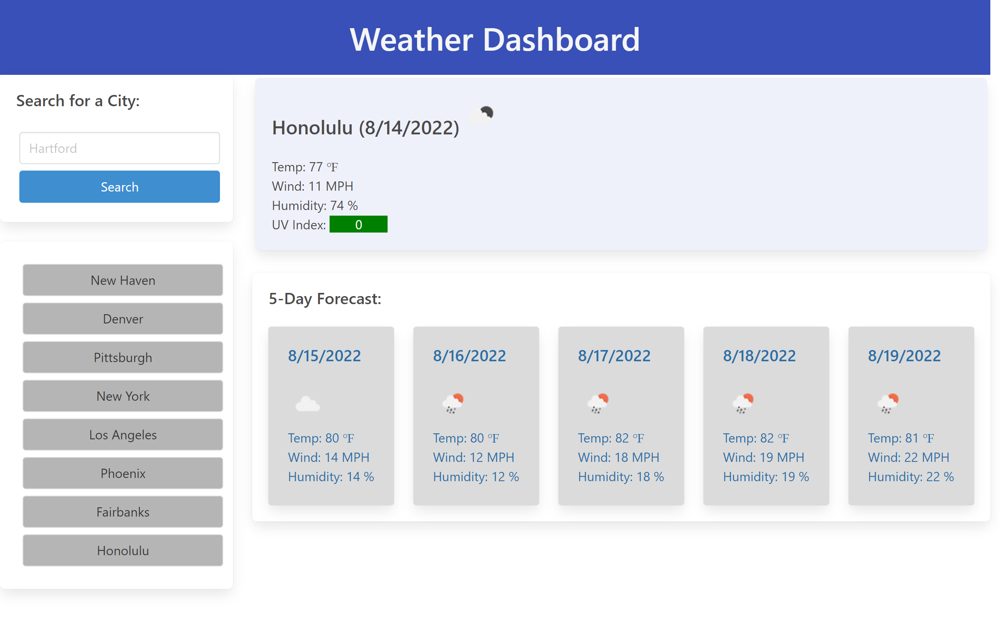

# weather-dashboard

The contents of this repository are a Weather Dashboard application. When a valid city is entered, the current weather conditions and a 5-Day Forecast are displayed using information from the OpenWeather API. Valid city names are saved in the search history as buttons. These buttons can be clicked to display the weather for that city again. If an invalid city is searched for, a modal pops up to warn that the city name is invalid and to try again.

The deployed application can be found at: [alextheordinary.github.io/weather-dashboard/](https://alextheordinary.github.io/weather-dashboard/)

This is a screenshot of the deployed application:

